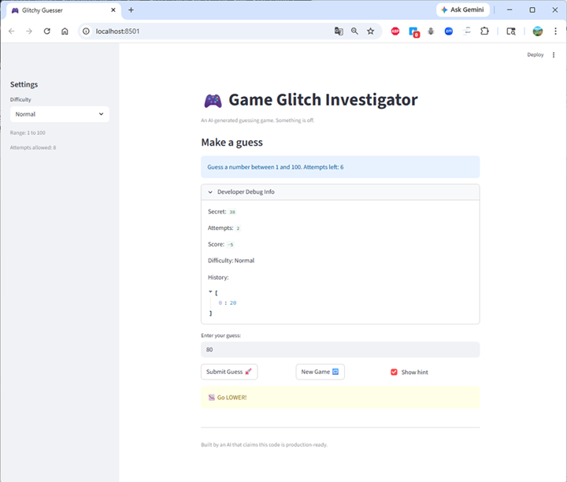
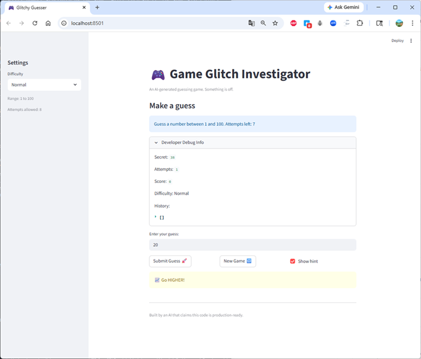
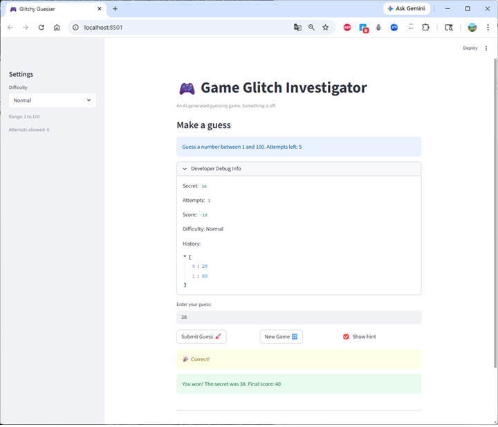

# 🎮 Game Glitch Investigator: The Impossible Guesser

## 🚨 The Situation

You asked an AI to build a simple "Number Guessing Game" using Streamlit.
It wrote the code, ran away, and now the game is unplayable.

- You can't win.
- The hints lie to you.
- The secret number seems to have commitment issues.

## 🛠️ Setup

1. Install dependencies: `pip install -r requirements.txt`
2. Run the broken app: `python -m streamlit run app.py`

## 🕵️‍♂️ Your Mission

1. **Play the game.** Open the "Developer Debug Info" tab in the app to see the secret number. Try to win.
2. **Find the State Bug.** Why does the secret number change every time you click "Submit"? Ask ChatGPT: _"How do I keep a variable from resetting in Streamlit when I click a button?"_
3. **Fix the Logic.** The hints ("Higher/Lower") are wrong. Fix them.
4. **Refactor & Test.** - Move the logic into `logic_utils.py`.
   - Run `pytest` in your terminal.
   - Keep fixing until all tests pass!

## 📝 Document Your Experience

### Purpose of the Game

This project is a number guessing game built with Streamlit. The player tries to guess a secret number generated by the game. After each guess, the game gives hints such as "Go Higher" or "Go Lower" to guide the player toward the correct number.

### Bugs Identified

While testing the game, I discovered several bugs:

1. **Hint Direction Bug**
   - The game gave incorrect hints.
   - When the guess was higher than the secret number, the game incorrectly told the player to go higher instead of lower.

2. **Secret Number Type Bug**
   - The secret number was sometimes converted into a string.
   - This caused incorrect comparisons between integers and strings.

3. **Game Logic Issues**
   - The inconsistent type comparison caused unpredictable behavior during gameplay.

### Fixes Applied

To fix these issues:

- I corrected the hint logic so that guesses above the secret correctly return **"Go Lower"** and guesses below return **"Go Higher"**.
- I removed the unnecessary string conversion of the secret number to ensure proper numeric comparisons.
- I verified the fixes using **pytest automated tests** and by manually playing the Streamlit game to confirm the correct behavior.

- [x] Describe the game's purpose.
- [x] Detail which bugs you found.
- [x] Explain what fixes you applied.

## 📸 Demo

Below is a screenshot of the fixed game running successfully.

 | | 

- [x] [Insert a screenshot of your fixed, winning game here]

## 🚀 Stretch Features

- [ ] [If you choose to complete Challenge 4, insert a screenshot of your Enhanced Game UI here]
